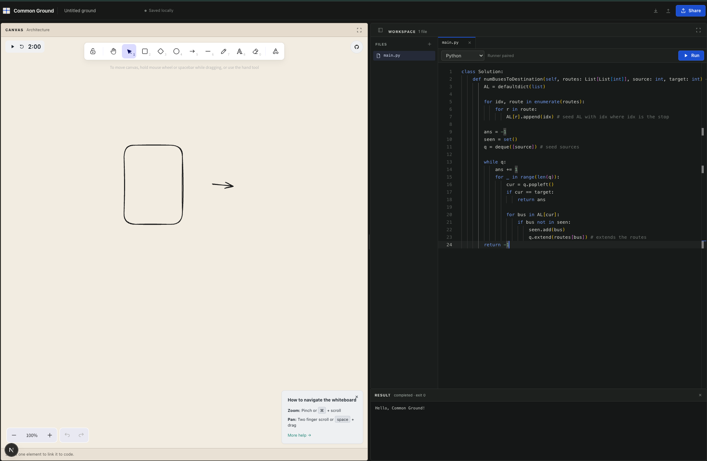

# Common Ground

Local-first architecture workbench: Excalidraw, a Python-first Monaco editor, portable `.ground` projects, local Docker execution, and encrypted ephemeral rooms. Built for system design interviews.



## Start locally

Prerequisites:

- Node.js 24 or later
- pnpm 11.1.2. Enable the version bundled with Node once with `corepack enable`, or install it with `npm install --global pnpm@11.1.2`.

```sh
pnpm install
pnpm dev
```

Open `http://localhost:3000/workspace`. Stop the development server with `Ctrl-C`.

## Run programs locally

New workspaces open `main.py`; choose a language beside the editor and press Run. The first Run guides local setup with this exact-origin command:

```sh
go run ./runner/cmd/common-ground-runner -origin http://localhost:3000
```

After the connection check, enter the helper's pairing code. The selected program runs immediately, and later runs are one click.

See [DESIGN.md](DESIGN.md) for the product, security, and architecture contract.
